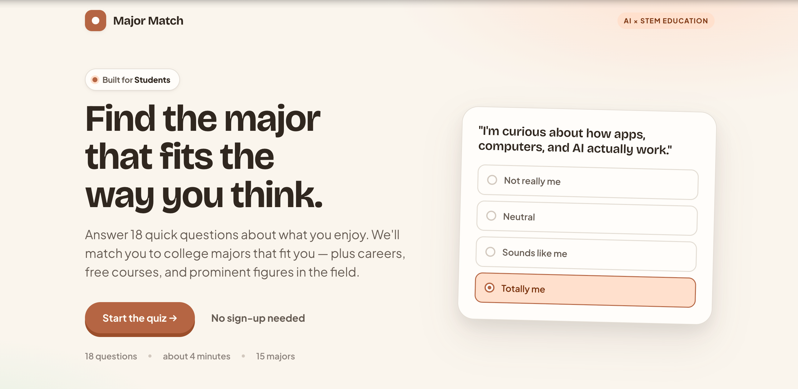

<div align="center">

# 🎓 Major Match

### Find the college major that fits the way you think.

**[ ▶ Try the live demo ](https://majormatchdeltastem.vercel.app)**

*A 4-minute interests quiz that matches students to college majors — then uses AI to
tell them how to start. No sign-up. Free.*

Hackathon submission · theme: **AI × STEM Education**

<br>



</div>

---

## The problem

Most high schoolers have to choose courses now and a major soon — with almost no idea
what actually fits them. "What should I study?" usually gets answered by guessing, or
by whatever their friends are doing. Major Match turns that blank stare into a ranked,
personalized starting point.

## What it does

1. **Answer 18 quick questions** about what you enjoy (rate 1–5).
2. **Get matched** to college majors by a real similarity algorithm.
3. **Explore** your best fit: match score, related careers + salaries, free starter
   resources, and role models.
4. **Get an AI plan** — a personalized note explaining *why* it fits you and 3 concrete
   first steps to take this month.

## How it works

```
18-question quiz  →  score into 8 interest traits  →  rank majors by cosine similarity
                                                              │
        AI advisor: personalized note + 3 first steps  ←──────┘
```

- **The matching is real ML, not a lookup.** Each answer builds a vector across 8
  interest traits; each major is also a trait vector. Majors are ranked by **cosine
  similarity** — the same math behind recommendation engines.
- **The AI is grounded in the result.** The student's strongest traits + top major are
  sent to Google Gemini, which writes the personalized plan. The API key lives on the
  server and is never exposed to the browser.
- **Zero friction.** No login, no install to use the live demo.

## Built with

`Vanilla HTML / CSS / JavaScript` (no framework, no build step) · `Node` serverless
backend · `Google Gemini` for the AI advisor · deployed on `Vercel`.

---

<details>
<summary><b>Run it locally</b> (for anyone who wants to read or extend the code)</summary>

Requires [Node.js](https://nodejs.org) (v21+) and a free
[Gemini API key](https://aistudio.google.com/apikey).

```bash
git clone https://github.com/junnywoo14-commits/majormatch.git
cd majormatch
cp .env.example .env     # then paste your free Gemini key into .env
node dev-server.js       # open http://localhost:3000
```

No `npm install` needed — zero dependencies. The quiz, matching, and results work
without a key; only the AI advisor needs one.

</details>

<details>
<summary><b>Project structure</b></summary>

| File | What it does |
|------|--------------|
| `index.html` | Page shell + fonts |
| `style.css` | Styling (warm, earthy design system) |
| `data.js` | 8 traits · 18 questions · 15 majors |
| `scoring.js` | Cosine-similarity matching engine |
| `script.js` | The three screens: welcome → quiz → results |
| `lib/advisor.js` | Calls Gemini for the personalized note (server-side) |
| `dev-server.js` | Local server (static files + `/api/advisor`) |
| `api/advisor.js` | Vercel serverless version of the same endpoint |

</details>
